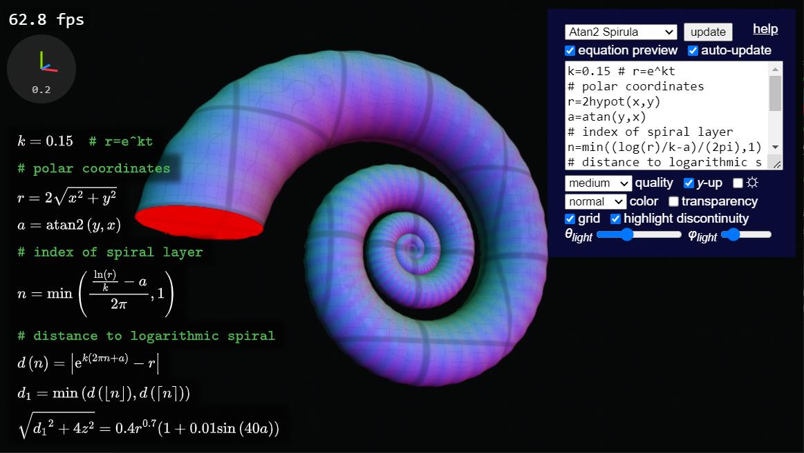
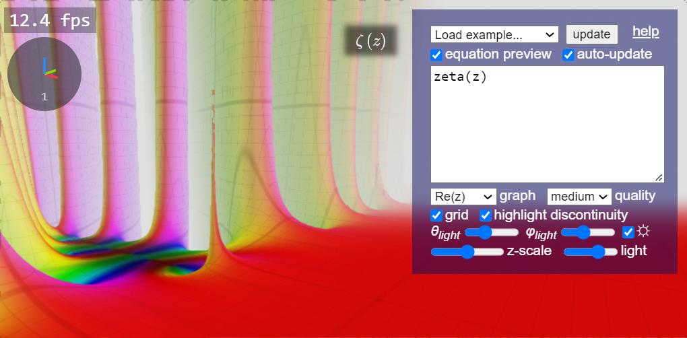

# Spirula

GPU-accelerated function graphers in a web browser, both 3D and 2D.

This is a personal passion project. I couldn't find a 3D graphing calculator with satisfying 3D implicit surface rendering on the internet, so I made one. I was initially inspired by raymarching demos on [Shadertoy](https://www.shadertoy.com/), but as I extended the equation parser and renderer to other types of math functions, currently implemented function graphers are not limited to implicit ones:

 - [3D implicit surface grapher](./implicit3/index.html)
 - [3D parametric surface grapher](./paramsurf/index.html)
 - [Complex domain coloring grapher (2D)](./complex/index.html)
 - [Complex domain coloring grapher (3D)](./complex3/index.html)

[//]: # "- [Implicit curve grapher](./implicit2/index.html) (for testing, not intended to be useful)"

It is important to note that these function graphers are developed completely by my effort, and many features I implemented are biased toward personal use. Since I don't have much knowledge of advanced functions (especially the complex-variable ones, which I only found their graphs to be visually cool), I cannot guarantee the mathematical practicability and accuracy of these tools. If you have any suggestions or believe you are experiencing a bug, feel free to [open an issue on GitHub](https://github.com/harry7557558/spirula/issues).

The name "Spirula" comes from the name of a [deep-ocean cephalopod mollusk](https://en.wikipedia.org/wiki/Spirula) that has distinctive spiral shells. I consider myself a fan of spirals so it's not surprising that you see a lot of spirals in example graphs.

----

## Features

The equation parser implements the following features:
 - Function and variable definition
 - Comments (start with `#`, `%`, or `//`)
 - LaTeX preview
 - Real-time shader generation
 - Special functions

The 3D graphers implements the following parameters/features:
 - Multiple shading modes
 - Dark and light color themes
 - Speed vs. quality control
 - Lighting control
 - Axes and grid
 - Red highlight discontinuity
 - Semi-transparent surface shading
 - Anti-aliasing

Experimental features (subject to change):
 - Animation via `iTime(0)`
 - Export C++ code for 3D implicit grapher, via `exportCurrentFunction('cppd')` in the browser JS console

----

## Limitations

These tools have the following dependencies:
 - [WebGL 2](https://webglreport.com/?v=2)
    - `EXT_disjoint_timer_query_webgl2`, an FPS counter will be shown when available
    - *`EXT_color_buffer_float`*, currently not required but is very likely a dependency in the future
 - [MathJax 3](https://www.mathjax.org/), required for rendering equation preview

These tools have the following known issues:
 - Incompatibility across devices for functions with overflow and NaN
 - Reduced quality when rendering implicit surfaces with transparency
 - The parser has ambiguity in resolving conflicting variable names

Features that may be implemented in the future (ordered approximately by priority):
 - Exporting 3D models
 - Automatic differentiation
 - Vectors and complex numbers
 - Mathematically-defined custom colors
 - Iterative refinement to improve rendering quality
 - More viewport control parameters
 - Variable sliders
 - Graph sharing via URL
 - `<iframe>` embed for webpages
 - Better expression editor (highlighting, bracket matching, etc.)
 - More [domain coloring parameters](https://en.wikipedia.org/wiki/Domain_coloring) for complex graphers

----

## Gallery

Complex domain coloring

Complex domain coloring in 3D

A sextic algebraic surface

The Burning Ship fractal

An algebraic star surface with transparency

Complex 3D plots of the Gamma function and the Riemann Zeta function

This page was updated on 2023/05/03.
