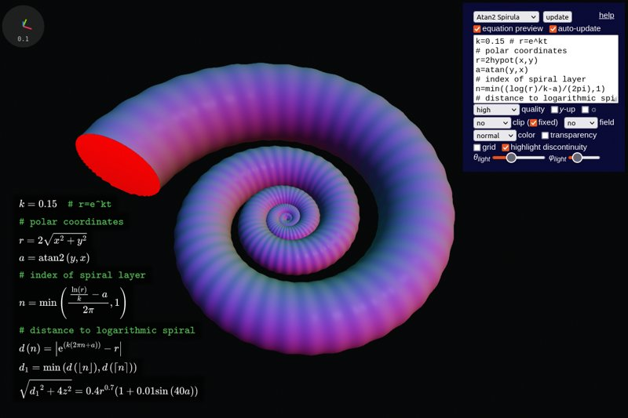
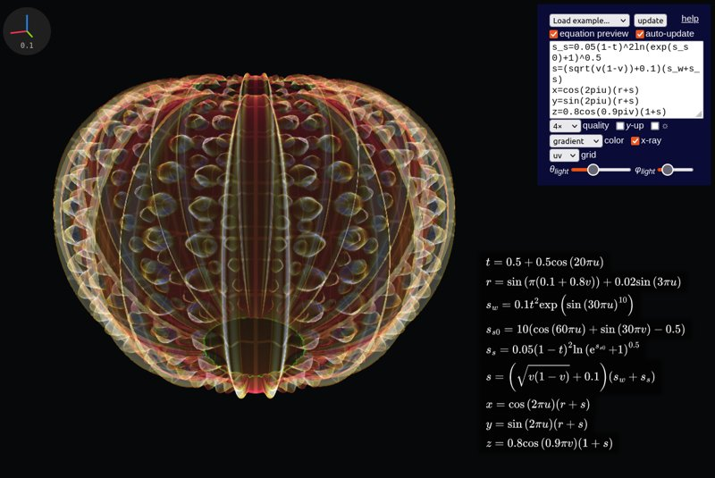
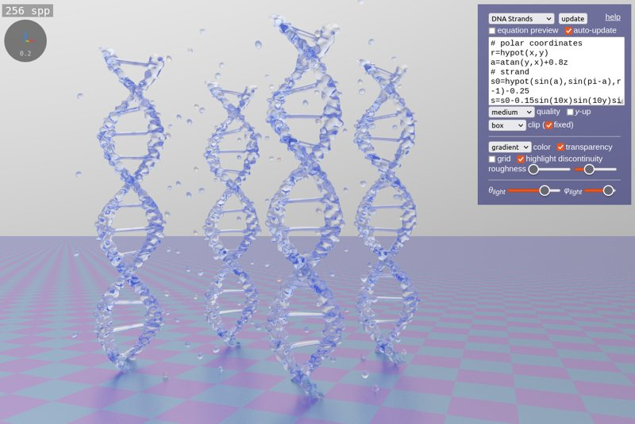
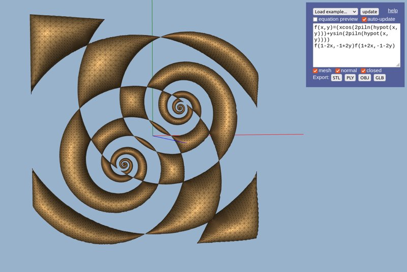
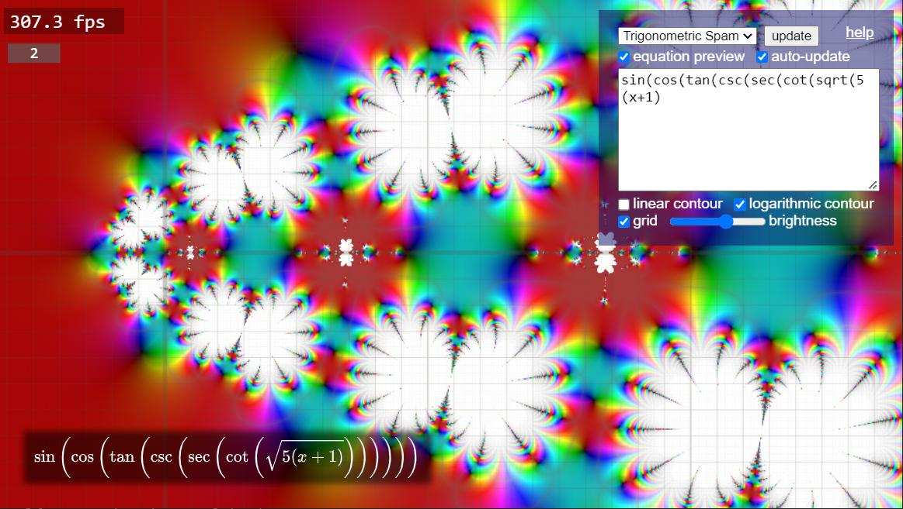
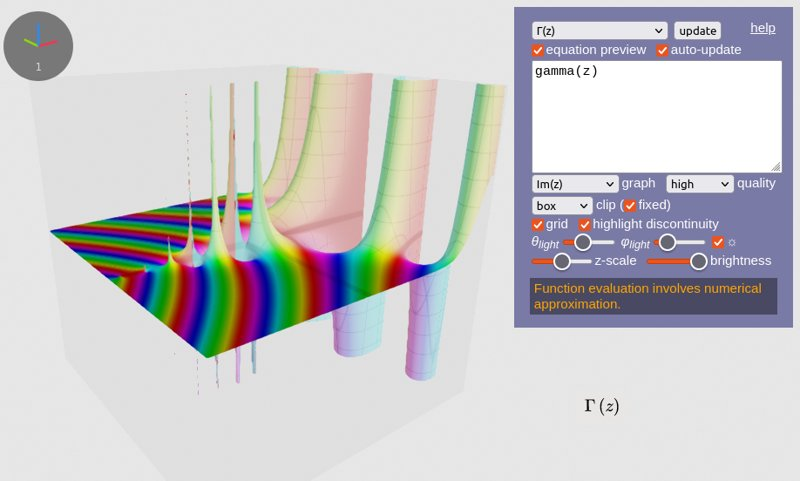
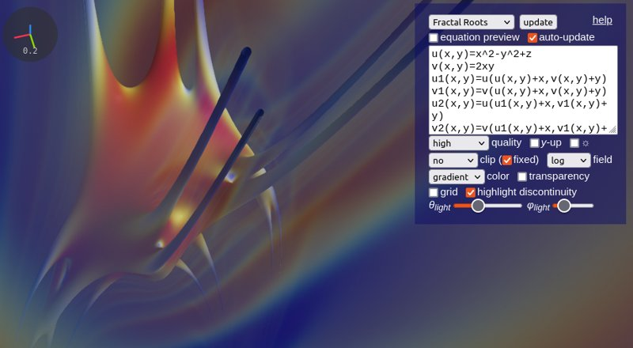

# 
Spirulae

*by Harry Chen - updated July 2023*

 

<a href="implicit3/" style="display:inline-block;text-align:center;width:48%">
   </img>
    
   3D Implicit Surface Grapher
</a>
<a href="paramsurf/" style="display:inline-block;text-align:center;width:48%">
   </img>
    
   3D Parametric Surface Grapher
</a>
<a href="complex/" style="display:inline-block;text-align:center;width:48%">
   </img>
    
   Complex Domain Coloring Grapher
</a>
<a href="complex3/" style="display:inline-block;text-align:center;width:48%">
   </img>
    
   3D Complex Domain Coloring Grapher
</a>
<a href="implicit3-rt/" style="display:inline-block;text-align:center;width:48%">
   </img>
    
   Implicit Surface Path Tracer (beta)
</a>
<a href="meshgen2/" style="display:inline-block;text-align:center;width:48%">
   </img>
    
   2D to 3D Mesh Generator (beta)
</a>

GPU-accelerated function graphers in a web browser, both 3D and 2D.

This is a personal passion project. I couldn't find a 3D graphing calculator with satisfying 3D implicit surface rendering on the internet, so I made one. I was initially inspired by raymarching demos on [Shadertoy](https://www.shadertoy.com/), but as I extended the equation parser and renderer to other types of math functions, currently implemented function graphers are not limited to implicit ones.

It is important to note that these function graphers are developed completely by my effort, and many features I implemented are biased toward personal use. Since I don't have much knowledge of advanced functions (especially the complex-variable ones, which I only found their graphs to be visually cool), I cannot guarantee the mathematical practicability and accuracy of these tools. If you have any suggestions or believe you are experiencing a bug, feel free to [open an issue on GitHub](https://github.com/harry7557558/spirulae/issues).

The name "Spirulae" comes from the name of a [deep-ocean cephalopod mollusk](https://en.wikipedia.org/wiki/Spirula) that has distinctive spiral shells. I consider myself a fan of spirals, so it shouldn't be surprising that you see a lot of spirals in examples.

----

## Features

The equation parser implements the following features:
 - Function and variable definition
 - Comments (start with `#`, `%`, or `//`)
 - LaTeX preview
 - Real-time shader generation
 - Special functions

The 3D graphers implements the following parameters/features:
 - Infinite and bounded domain
 - Scalar field visualization
 - Speed vs. quality control
 - Multiple shading and grid modes
 - Dark and light color themes
 - Semi-transparent surface shading
 - Lighting control
 - Red highlight discontinuity
 - Anti-aliasing

Experimental features (subject to change):
 - Animation via `iTime(0)`
 - Export C++ code for 3D implicit grapher, via `exportCurrentFunction('cppd')` in the browser JS console

----

## Limitations

These tools have the following dependencies:
 - [WebGL 2](https://webglreport.com/?v=2)
    - *`EXT_color_buffer_float`*, required for path tracing and mesh generation
    - `EXT_disjoint_timer_query_webgl2`, an FPS counter will be shown when available
 - [MathJax 3](https://www.mathjax.org/), required for equation preview

These tools have the following known issues:
 - Incompatibility across devices for functions with overflow and NaN
 - Reduced quality when rendering implicit surfaces with transparency
 - The parser has ambiguity in resolving conflicting variable names

----

## Working in Progress

Spirulae is under active development. Tools and features that are being developed include:
 - 2D mesh generation (`/meshgen2`)
 - Ray tracing (`/implicit3-rt`)
 - Automatic differentiation (`/autodiff`)
 - Exporting 3D models
 - Automatic differentiation

Features that may be implemented in the future (ordered approximately by priority):
 - Vectors and complex numbers
 - Mathematically-defined custom colors
 - Iteratively improve rendering quality
 - More viewport control parameters
 - Variable sliders
 - Graph sharing via URL
 - `<iframe>` embed for webpages
 - Better expression editor (highlighting, bracket matching, etc.)
 - More [domain coloring parameters](https://en.wikipedia.org/wiki/Domain_coloring) for complex graphers

----

## Gallery

Complex domain coloring

The Gamma function in 3D

A sextic algebraic surface

A fractal with scalar field visualized

A clipped quintic implicit surface, with volumetrics showing isosurfaces

A parametric surface rendered in X-ray mode

A path-traced fractal (working in progress)

