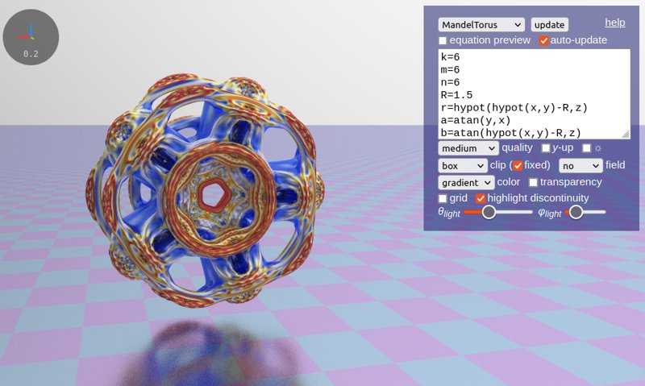

<h1><a style='color:inherit;text-decoration:none' href="https://harry7557558.github.io/spirulae/">Spirulae</a></h1>

*by Harry Chen - updated September 2023*

GPU-accelerated function graphers in a web browser, both 3D and 2D.

This is a personal passion project. I couldn't find a 3D graphing calculator with satisfying 3D implicit surface rendering on the internet, so I made one. I was initially inspired by raymarching demos on [Shadertoy](https://www.shadertoy.com/), but as I extended the equation parser and renderer to other types of math functions, currently implemented function graphers are not limited to implicit ones.

It is important to note that these function graphers are developed completely by my effort, and many features I implemented are biased toward personal use. Since I don't have much knowledge of advanced functions (especially the complex-variable ones, which I only found their graphs to be visually cool), I cannot guarantee the mathematical practicability and accuracy of these tools. If you have any suggestions or believe you are experiencing a bug, feel free to [open an issue on GitHub](https://github.com/harry7557558/spirulae/issues).

The name "Spirulae" comes from the name of a [deep-ocean cephalopod mollusk](https://en.wikipedia.org/wiki/Spirula) that has distinctive spiral shells. I consider myself a fan of spirals, so it shouldn't be surprising that you see a lot of spirals in examples.

----

## Features

The equation parser implements the following features:

 - Function and variable definition
 - Comments (start with `#`, `%`, or `//`)
 - LaTeX preview
 - Real-time shader generation
 - Special functions

The 3D graphers implements the following parameters/features:

 - Infinite and bounded domain
 - Scalar field visualization
 - Speed vs. quality control
 - Multiple shading and grid modes
 - Dark and light color themes
 - Semi-transparent surface shading
 - Lighting control
 - Red highlight discontinuity
 - Anti-aliasing

Experimental features (subject to change):

 - Animation via `iTime(0)`
 - Export C++ code for 3D implicit grapher, via `exportCurrentFunction('cppd')` in the browser JS console

----

## Limitations

These tools have the following dependencies:

 - [WebGL 2](https://webglreport.com/?v=2)
    - `EXT_color_buffer_float`, required for path tracing and mesh generation
    - `EXT_disjoint_timer_query_webgl2` (*optional*), an FPS counter will be shown when available
 - WebAssembly, required for mesh generation
 - [MathJax 3](https://www.mathjax.org/), required for equation preview

These tools have the following known issues:

 - Incompatibility across devices for functions with overflow and NaN
 - Reduced quality when rendering implicit surfaces with transparency
 - The parser has ambiguity in resolving conflicting variable names

----

## Working in Progress

Spirulae is under active development. Tools and features that are being developed include:

 - 3D mesh generation (`/meshgen3`)
 - 2D mesh generation (`/meshgen2`)
 - 2D vector field (`/ode2`)
 - Automatic differentiation (`/autodiff`)

Features that may be implemented in the future (ordered approximately by priority):

 - Vectors and complex numbers
 - Differentiation in function definition
 - Mathematically-defined custom colors
 - Iteratively improve rendering quality
 - More viewport control parameters
 - Variable sliders
 - Graph sharing via URL
 - `<iframe>` embed for webpages
 - Better expression editor (highlighting, bracket matching, etc.)
 - More [domain coloring parameters](https://en.wikipedia.org/wiki/Domain_coloring) for complex graphers

----

## Frequently Asked Questions

**Q: Is Spirulae written from scratch?**

*Largely*. I tried to make Spirulae with as little dependency as possible, and therefore I wrote the equation parser and renderer from scratch without external libraries and frameworks, although it still uses native browser APIs like WebGL and WebAssembly. Spirulae uses [MathJax](https://www.mathjax.org/) to display equations, which can be considered its only dependency.

**Q: How to draw shapes using equations?**

Drawing meaningful shapes using equations is more about art techniques than rigorous mathematics. To get started, you can check [Inigo Quilez's YouTube channel](https://www.youtube.com/c/InigoQuilez) and videos like [this one](https://www.youtube.com/watch?v=aNR4n0i2ZlM). I also have a [Google Slide](https://docs.google.com/presentation/d/1CgVLkHcU2wQkaGv-QEvbTdrKlimdrVus-sfaRQyWHm8/edit) intended to introduce Desmos art to high school students that may cover similar principles and can be used as a dictionary.

**Q: How does Spirulae evaluate equations on the GPU?**

For readers with technical background, Spirulae recompiles shader every time the equation input or a graphing parameter is updated. Spirulae parses equations into [postfix notation](https://en.wikipedia.org/wiki/Reverse_Polish_notation#Explanation) and generates code of a GLSL function that can be compiled. Automatic differentiation can be done in this step. Generated shader code can be found in the browser's F12 developer console.

----

## Gallery

Complex domain coloring

The gamma function in 3D

A sextic algebraic surface

A fractal with scalar field visualized

A clipped quintic implicit surface, with volumetrics showing isosurfaces

A parametric surface rendered in X-ray mode

A path-traced fractal

