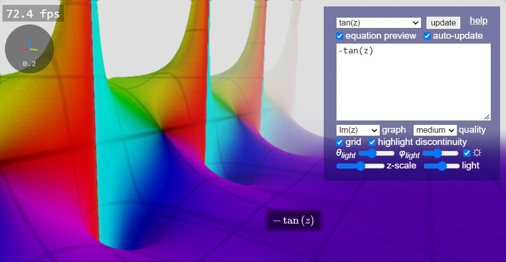

<h2>3D Complex Domain Coloring Grapher</h2>

By Harry Chen (harry7557558) - Complex domain coloring in 3D. This is a combination of the <a href="../complex/">domain coloring grapher</a> and the <a href="../implicit3/">implicit surface grapher</a>. I created this tool for no reason other than finding the graphs of complex functions to be visually cool.

This tool visualizes complex-variable math functions in 3D based on user inputs. Type equations in the input box, or look at some examples. Drag the canvas to rotate the surface, and scroll to zoom in/out. Drag while holding <code>Shift</code> to move the graph on the screen. Reset the viewport by switching to an example and switching back (you may want to back up your input). Try to play with selectors, checkboxes, and sliders.

You need a device/browser that supports <a href="https://webglreport.com/?v=2" target="_blank">WebGL 2</a> to run this tool. An FPS counter will be available if your browser supports the <code>EXT_disjoint_timer_query_webgl2</code> extension. If the graph takes too long to update, uncheck the "auto-update" checkbox and apply your change by clicking the "update" button or pressing <code>Alt+Enter</code>.

A preview of the equation is available via <a href="https://www.mathjax.org/" target="_blank">MathJax</a>. You can drag it to move it, or turn it off/on by unchecking/checking the "equation preview" checkbox.

<h3>Entering equations</h3>

Use $x$ or $z$ (depends on your preference, but not both) as the independent variable. Input your function as an expression involving $x$ or $z$. Enter $i$ or $j$ for the imaginary unit. Use <code>^</code> for power/exponentiation, <code>*</code> for multiplication, and <code>/</code> for division. You can use built-in functions like real-valued <code>re()</code>, <code>im()</code>, <code>length()</code>, and <code>arg()</code>, the complex conjugate <code>conj()</code>, elementary functions like <code>exp()</code>, <code>sin()</code>, <code>sqrt()</code>, and <code>atanh()</code>, special functions like the <a href="https://mathworld.wolfram.com/LogGammaFunction.html" target="_blank">logarithm of the Gamma function</a> <code>lgamma()</code> and the <a href="https://en.wikipedia.org/wiki/Riemann_zeta_function" target="_blank">Riemann zeta function</a> <code>zeta()</code>, etc. Note that <code>log(x)</code> evaluates the natural logarithm by default. For $\log_a(x)$, type <code>log(a,x)</code>.

<b>Defining variables</b>: A variable name starts with a letter, followed by an (optional) underscore and a string of letters or numbers. Example variable names are <code>k</code>, <code>x0</code> ($x_0$, equivalent to <code>x_0</code>), <code>x_t</code> ($x_t$) and <code>A_11</code> ($A_{11}$). For example, you can define <code>a=x+y</code> and enter <code>k=a*sin(a)</code> as the main equation.

<b>Defining functions</b>: The name of a function (and its arguments) are similar to variable names. A function may be defined as <code>f(t)=t*sin(t)</code> and called like <code>z=f(x)*f(y)</code>, or defined as <code>g(a,b)=sin(a)*cos(b)</code> and called like <code>z=g(x+y,x-y)</code>.

<b>Comments</b>: A comment can be a single line or after a line of expression, starting with the character <code>#</code>.

<h3>Graphing parameters</h3>

These parameters determine how the equation is rendered. Right-click a slider to set it to its default value. Regardless of these parameters, a pixel involving a NaN value in the shading will be displayed in dark green.

<b>Graph</b>: During rendering, the graph is treated as an implicit surface $z=h(f(x+iy))$, where $h$ is a real-valued function with a complex parameter that can be selected using this selector.

<ul>
<li><code>Re(z)</code> - the real part of the function</li>
<li><code>Im(z)</code> - the imaginary part of the function</li>
<li><code>|z|</code> - the magnitude of the function</li>
<li><code>ln(|z|)</code> - the logarithm of the magnitude of the function</li>
<li><code>ln(|z|)+|z|</code> - closer to <code>|z|</code> when $|z|$ is large and closer to <code>ln(|z|)</code> when $|z|$ is small</li>
<li><code>ln(|z|+1)</code> - closer to <code>|z|</code> when $|z|$ is small and closer to <code>ln(|z|)</code> when $|z|$ is large</li>
<li><code>1/|z|</code> - the reciprical of the magnitude of the function</li>
<li><code>-ln(|z|)</code> - the logarithm of the reciprical of the magnitude of the function</li>
<li><code>asinh(Re(z))</code> - the real part of the function on a logarithm-like scale with the consideration of the sign</li>
<li><code>Im(z)</code> - the imaginary part of the function on a logarithm-like scale with the consideration of the sign</li>
</ul>

<b>Quality</b>: A higher quality means a smaller raymarching step in rendering, which is slower but usually produces a more accurate image.

<b>Grid</b>: When checked, this tool will display an adaptive grid on the surface, making it easier to see the size of the object and read the coordinates of a point.

<b>Discontinuity</b>: In rendering, the surface is defined by a set of points with changes of sign, which is either a zero or a discontinuity. Check this to detect and red highlight discontinuity.

<b>Lighting angles</b>: As the <i>θlight</i> slider is dragged from left to right, the light moves from bottom to bottom counter-clockwise. As the <i>φlight</i> slider is dragged from left to right, the light moves from front to back. The light rotates to fit this description as the viewport rotates.

<b>Z-scale</b>: This parameter controls the display height of the surface. Slide it left to make it flatter and right to make it higher.

<b>Brightness</b>: The rendering appears darker when this slider is set left and lighter as it moves right.

<h3>Technical details</h3>

This tool implements the raymarching algorithm in WebGL fragment shaders. The equation is treated as an implicit surface. The renderer casts rays from the camera and numerically finds its intersections with the surface. The raymarching step size is calculated by dividing the value of the scalar field by the magnitude of the directional derivative along the ray (in screen space) and clamped based on a given step size, which can be changed through the "quality" selector.

In the first pass, it marches along the ray to determine an interval where intersections may exist. Then, the result is pooled using min/max functions with neighboring pixels to avoid missing intersections. These two passes are done in 0.25x of the screen resolution. The main raymarching function checks intersections within the calculated intervals. A bisection search is performed when the first sign change is detected, and the color is calculated and returned.

The rendered image goes through an anti-aliasing pass. This pass uses a filter based on linear regression to anti-alias the image. A description and implementation of the algorithm can be found <a href="https://www.shadertoy.com/view/sllczM" target="_blank">here</a>.

The input entered is parsed in JavaScript. After preprocessing (ex. adding multiplication signs), the input is parsed to the postfix notation using the <a href="https://en.wikipedia.org/wiki/Shunting-yard_algorithm" target="_blank">shunting-yard algorithm</a>. When generating GLSL code, the expression is evaluated on a stack with caching of common subtrees. Generated GLSL code is logged to the console, which can be found under the "Console" tab of the F12 developer tool.

The source code of this tool can be found on <a href="https://github.com/harry7557558/spirulae/tree/master/complex3" target="_blank">GitHub</a>.

